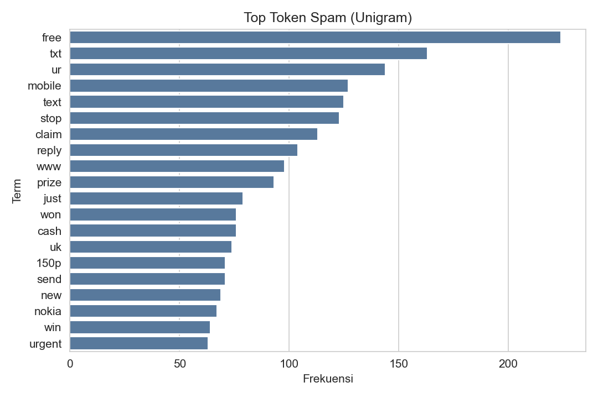
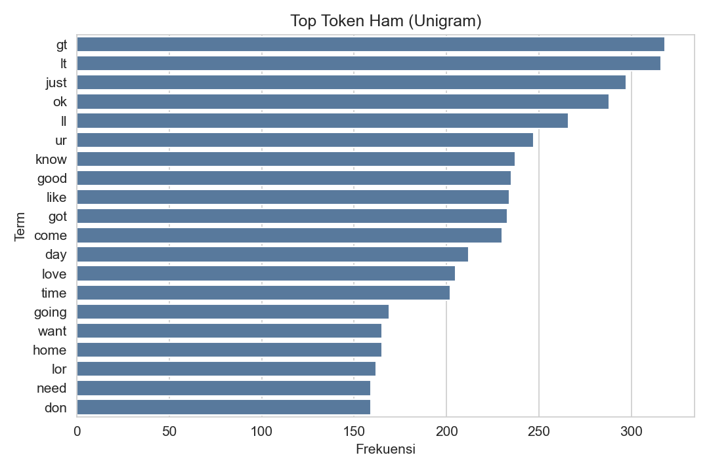
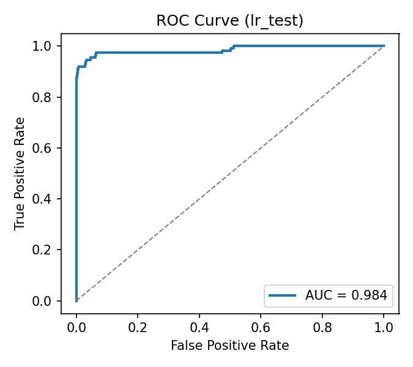
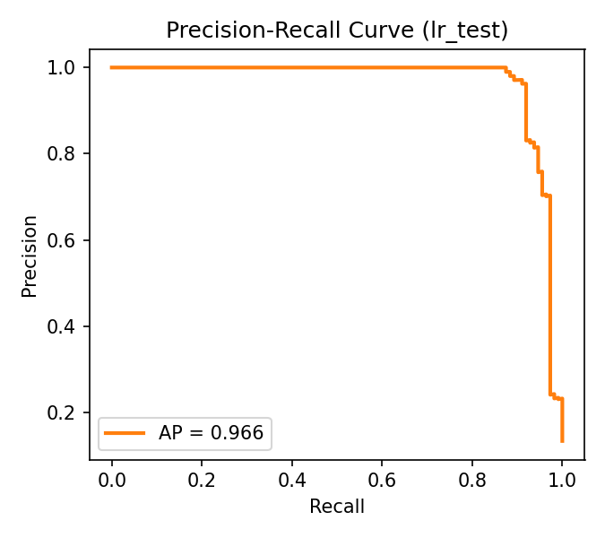
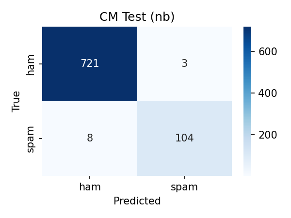

% Perancangan Prototipe Klasifikasi Spam SMS
% Naive Bayes vs Logistic Regression
% November 2025

# Agenda
- Latar belakang & tujuan
- Dataset & eksplorasi
- Metodologi & model
- Pelatihan & evaluasi
- Hasil & analisis
- Prototipe & MLOps
- Kesimpulan & pekerjaan lanjutan

# Latar Belakang & Tujuan
- Spam SMS menimbulkan risiko penipuan dan pengalaman buruk.
- Tujuan: merancang pipeline end-to-end untuk deteksi spam SMS dan membandingkan MNB vs LR.
- Kontribusi: pipeline reprodusibel, perbandingan model klasik, prototipe Streamlit & API Flask.

# Dataset (UCI SMS Spam Collection)
- Total: 5.572 SMS — 4.825 ham, 747 spam (≈13,41%).
- Format: TSV dua kolom (label, teks).
- Karakteristik: teks pendek, bahasa informal, ketidakseimbangan sedang.
- Rujukan: Almeida et al., 2011 (UCI ML Repository).

# EDA: Distribusi Panjang Pesan

- Histogram menunjukkan jumlah token per pesan untuk ham vs spam.
- Rata-rata token: semua ≈ 15,60; ham ≈ 14,31; spam ≈ 23,91.
- Warna membedakan kelas; kurva lebih ke kanan = pesan lebih panjang. Spam cenderung lebih panjang dari ham.

# EDA: Top Token Spam vs Ham

- Spam: kata pemicu umum seperti "free", "win", "urgent", "claim", "call", "prize".
- Ham: percakapan sehari-hari, konfirmasi, informasi non-promosi.
- Setiap bar mewakili seberapa sering kata muncul di kelas terkait (lebih panjang = lebih sering).
- Insight: banyak spam memuat kata promosi/ajakan tindakan; ham didominasi kata percakapan biasa.

# Metodologi & Pipeline
- Praproses: lowercasing, TF–IDF (unigram–bigram), stopwords Inggris.
- Model: Multinomial Naive Bayes (MNB) dan Logistic Regression (LR).
- Validasi: StratifiedKFold k=5; GridSearchCV.
- Metrik: Accuracy, Precision, Recall, F1, ROC–AUC, PR–AUC.

# Model: Multinomial Naive Bayes
- Cocok untuk fitur frekuensi non-negatif.
- Hiperparameter utama: alpha (smoothing).
- Kelebihan: cepat, sederhana, baseline kuat.

# Model: Logistic Regression
- Probabilistik dengan regularisasi L2.
- Hiperparameter: C, class_weight (menangani imbalance), max_iter.
- Kelebihan: fleksibel, performa kuat, dapat dikalibrasi.

# Pelatihan & Penalaan
- Ruang hyperparameter:
  - TF–IDF: ngram (1,1) vs (1,2), min_df {1,2,5}
  - MNB: alpha {0.1, 0.5, 1.0}
  - LR: C {0.5,1,2,4}, L2, class_weight {None, balanced}
- Skor optimasi: F1 (kelas spam).

# Hasil Ringkas

| Model | Representasi | Hiperparameter | Accuracy | F1 (makro) | F1 (spam) | AUC |
|---|---|---|---:|---:|---:|---:|
| MNB | TF–IDF (1–2) | alpha=0.5 | ~0.97 | ~0.96 | ~0.95 | ~0.99 |
| LR  | TF–IDF (1–2) | C=2.0, L2, balanced | ~0.98 | ~0.97 | ~0.97 | ~0.99 |

- LR unggul tipis; MNB sangat kompetitif dan lebih ringan.

# Kurva ROC & PR (Contoh LR)

- ROC: sumbu X = False Positive Rate, Y = True Positive Rate. Semakin dekat ke pojok kiri-atas semakin baik; luas area (AUC) mendekati 1 = performa sangat baik.
- PR: sumbu X = Recall, Y = Precision. Lebih informatif saat kelas spam lebih sedikit; kurva tinggi dan ke kanan menandakan precision dan recall sama-sama bagus.
- Memindahkan threshold akan menggeser posisi pada kurva — bisa dipilih sesuai prioritas (minim FP vs minim FN).

# Analisis Kesalahan & Confusion Matrix
- False positive: pesan promosi sah dengan kata mirip spam.
- False negative: obfuscation ("GR4T1S"), URL pendek, bahasa campuran.

- Confusion matrix: baris = label sebenarnya, kolom = prediksi model.
- Nilai diagonal (kiri-atas & kanan-bawah) adalah prediksi benar — makin besar makin baik.
- Sel kanan-atas = ham→spam (FP), sel kiri-bawah = spam→ham (FN). Tuning threshold/fitur dapat mengurangi keduanya.

# Prototipe, Integrasi, & MLOps/Keamanan
- Streamlit: input teks, probabilitas, pengaturan threshold.
- Flask API: endpoint /predict untuk integrasi sistem.
- Monitoring: skor, drift, keluhan pengguna; kalibrasi & thresholding berbasis biaya.
- Privasi: minimisasi data, enkripsi, retensi terbatas. Inferensi cepat, footprint kecil (edge-friendly).

# Manfaat & Penerapan Sehari-hari
- Operator seluler: memfilter SMS spam/phishing sebelum mencapai pelanggan; menurunkan komplain dan beban CS.
- Perbankan/fintech: proteksi phishing pada notifikasi/OTP; pengurangan fraud dan kerugian finansial.
- E-commerce/logistik: penyaringan blast promo & notifikasi agar relevan, menghindari false spam pada pesan sah.
- Pemerintah/layanan publik: memastikan SMS informasi darurat/layanan tidak ditandai spam.
- Perusahaan: triase inbound SMS (dukungan pelanggan), eskalasi otomatis untuk pesan berisiko.
- Individu/app pribadi: perlindungan spam on-device; model ringan cocok untuk perangkat lama.
- Keamanan & kepatuhan: membantu pemenuhan kebijakan anti-spam dan perlindungan data.

# Kesimpulan & Pekerjaan Lanjutan
- Pipeline TF–IDF + LR/MNB efektif dan ringan.
- LR sedikit unggul; MNB cocok sebagai baseline cepat.
- Lanjutan: fitur karakter, normalisasi ejaan, active learning, dan studi banding model transformer ringan.
